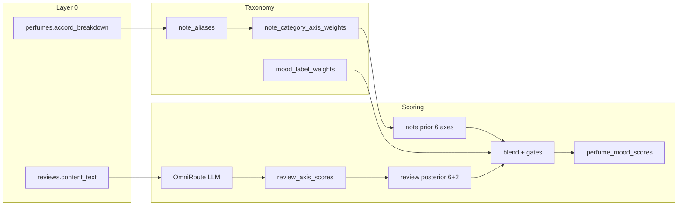

# Mood scoring — technical summary

How Akord turns Fragrantica scrape data into per-perfume mood scores.

**Code:** `pipeline/` (`notes.py`, `llm_client.py`, `review_scorer.py`, `mood_compute.py`)  
**Schema:** [`SQL_SCHEMAS.MD`](./SQL_SCHEMAS.MD) v0.3  
**Orchestration:** [`AUTOMATION_IMPLEMENTATION.MD`](./AUTOMATION_IMPLEMENTATION.MD)

---

## Pipeline overview

```text
perfumes + reviews (scrape)
        │
        ▼
① check-unmapped          note/accord raw text ∈ note_aliases?
        │
        ▼
② reviews/score           LLM → 8 scores (method=llm)
                          + NRC-VAD → valence/dominance (method=lexicon)
        │
        ▼
③ moods/compute (no LLM)  note prior ⊕ review posterior (V/D blended) → gates → labels
        │
        ▼
perfume_mood_scores       read via GET /perfumes/{id}/moods|summary|lexicon-check
```

| Step | Endpoint | LLM? | Writes |
|------|----------|------|--------|
| 1 | `POST /pipeline/notes/check-unmapped` | No | — |
| 2 | `POST /pipeline/reviews/score` | Yes + lexicon | `review_axis_scores` (llm + lexicon) |
| 2b | `POST /pipeline/reviews/score-lexicon` | No | lexicon rows only (backfill) |
| 3 | `POST /pipeline/moods/compute` | No | `perfume_mood_scores` |
| All | `POST /pipeline/run-all` | Step 2 | both |

Auth required on all `/pipeline/*`. Public reads: `/moods`, `/summary`, `/lexicon-check`.

---

## Conceptual model

Two layers of meaning:

| Layer | Keys | Role |
|-------|------|------|
| **Mood axes** (6) | `happiness`, `sensuality`, `energy`, `soothing`, `edibility`, `dominance` | Internal GEOS-style dimensions. Notes and reviews score these. |
| **Quality gates** (2) | `disgust`, `valence` | Filters only. Never appear in `mood_label_weights`. |
| **Mood labels** (8) | `romantic`, `elegant`, `confident`, `powerful`, `energetic`, `calm`, `cozy`, `grounded` | User-facing outputs. Weighted mixes of the 6 axes. |

Gates live in `quality_gates`; axes in `mood_axes`. FK on `mood_label_weights` → `mood_axes` only, so a gate cannot accidentally become a mood ingredient.

---

## Step 1 — Unmapped note gate

**Purpose:** Accords/notes that are not in `note_aliases` do not contribute to the note prior. Unknown strings are reported so taxonomy can be fixed.

**Inputs checked (normalized: lower + trim + collapse spaces):**

- Keys of `perfumes.accord_breakdown` (e.g. `"warm spicy"`, `"woody"`)
- Elements of `notes_top` / `notes_middle` / `notes_base`

**Lookup:** `note_aliases.raw_text` → `note_category_key` (30 Fragrantica wheel categories).

**Example:** Baccarat has `"metallic": 24` in `accord_breakdown`. `metallic` is not on the 30-category wheel and has no alias → listed as unmapped. With `run-all` without `force=true` → **409**. With `force=true`, pipeline continues; that accord simply contributes **0** to the prior.

---

## Step 2 — Review scoring (LLM)

**When:** Reviews that do not yet have a **full** set of 8 `method='llm'` rows in `review_axis_scores` (or after `rescore=true` wipe).

**Model:** `LLM_MODEL` via OmniRoute (`LLM_BASE_URL`, default `http://localhost:20128/v1`). One chat completion per review.

**Prompt contract:** Return **only** JSON with exactly these keys, each number **0–100**:

```json
{
  "happiness": 0,
  "sensuality": 0,
  "energy": 0,
  "soothing": 0,
  "edibility": 0,
  "dominance": 0,
  "disgust": 0,
  "valence": 0
}
```

Axis/gate English labels are loaded from `mood_axes.labels` / `quality_gates.labels` and injected into the rubric. Review body is truncated to 4000 chars. `temperature=0.2`. Invalid/missing keys → retry / error for that review.

**Persistence:** Upsert into `review_axis_scores` on unique `(review_id, axis_key, method)`.

| Column | Meaning |
|--------|---------|
| `review_id` | FK → `reviews` |
| `axis_key` | One of 6 axes **or** 2 gates (no FK by design) |
| `score` | 0–100 |
| `method` | `'llm'` or `'lexicon'` |

**Also on every review (free):** NRC-VAD unigram lookup → if `matched_words >= LEXICON_MIN_MATCHED_WORDS` (default 5), upsert `valence` + `dominance` as `method='lexicon'`. If the LLM call fails, lexicon is still attempted so the review can contribute V/D.

**Idempotency:** Already fully LLM-scored reviews are skipped on `/score`. Use `/score-lexicon` to backfill lexicon without new LLM calls.

**Rescore:** `rescore=true` **requires** `perfume_id`. Deletes **both** `llm` and `lexicon` rows for that perfume’s reviews, then re-runs step 2.

**Cost note:** Step 2 LLM is the only paid/slow step. Lexicon + step 3 are free/deterministic.

---

## Step 3 — Mood compute (deterministic)

Runs entirely in app code + DB reads. No LLM.

### 3a — Note prior (6 axes)

From `accord_breakdown` percentages (preferred):

1. Map each raw accord key → category via `note_aliases`.
2. Look up `note_category_axis_weights` for that category (weights per mood axis).
3. Weighted average:

\[
\text{prior}[a] = \frac{\sum_i p_i \cdot w(c_i, a)}{\sum_i p_i}
\]

where \(p_i\) is the accord percent, \(c_i\) the mapped category, \(w(c,a)\) the category→axis weight. Unmapped accords are skipped (not in the denominator).

**Fallback:** If `accord_breakdown` is empty, use mapped `notes_*` with equal weight.

**Toy example:**

| Accord | % | Category | dominance weight |
|--------|--:|----------|-----------------:|
| woody | 100 | woody | 80 |
| amber | 98 | amber | 60 |

\[
\text{prior}[\text{dominance}] \approx \frac{100\cdot80 + 98\cdot60}{100+98}
\]

(Same pattern for all 6 axes.)

### 3b — Review posterior (6 axes + 2 gates)

Load all `review_axis_scores` for the perfume (`llm` and `lexicon`) plus `reviews.vote_yes` / `vote_no`.

**`sample_size` (\(n\)):** count of reviews that have all **6 mood axes** via `method='llm'` (unweighted count). Character-relevant **opinions do not** change `n` or confidence tiering.

**Helpfulness weight** (every axis/gate; **not** conditioned on sentiment or score):

```text
net = max(0, (vote_yes or 0) - (vote_no or 0))
weight_i = min(1 + ln(1 + net), REVIEW_HELPFULNESS_WEIGHT_CAP)  # default 5
# null / net-negative → weight_i = 1
```

**Opinion weight** (character-relevant pros/cons from `perfume_opinion_scores`):

```text
weight_j = min(1 + ln(1 + fragrantica_score), PROS_CONS_WEIGHT_CAP)  # default 8
```

Opinions are scored separately (`POST /pipeline/opinions/score`) with an LLM
`character_relevant` filter — price/longevity/season/etc. never enter the table.

```text
posterior = (sum_i weight_i * review_score_i + sum_j weight_j * opinion_score_j)
          / (sum_i weight_i + sum_j weight_j)
```

**LLM-only** (`happiness`, `sensuality`, `energy`, `soothing`, `edibility`, gate `disgust`):
helpfulness-weighted mean of LLM scores (prefer complete reviews; fall back to any review with that key).

**Blended** (`dominance` mood axis, `valence` gate) — per review, then weighted mean:

```text
if llm and lexicon:  score_i = W*llm + (1-W)*lexicon   # W = LEXICON_BLEND_WEIGHT_LLM (0.65)
elif llm only:       score_i = llm
elif lexicon only:   score_i = lexicon
else:                skip
```

**Divergence** (for confidence / `/lexicon-check`): for each of valence/dominance,
helpfulness-weighted mean of `|llm - lexicon|` where both exist.

If \(n = 0\) and no lexicon-only signal: posterior axes ~0; confidence `low_prior`.

### 3c — Blend

Env: `PIPELINE_REVIEW_BLEND_THRESHOLD` (default **20**).

\[
w = \min\bigl(1,\ \tfrac{n}{\text{threshold}}\bigr)
\]

\[
\text{final}[a] = \text{prior}[a]\cdot(1-w) + \text{posterior}[a]\cdot w
\]

| \(n\) | \(w\) | Behavior |
|------:|------:|----------|
| 0 | 0 | 100% note prior |
| 10 | 0.5 | Equal blend |
| ≥ 20 | 1.0 | 100% review posterior |

### 3d — Quality gates

Env: `PIPELINE_DISGUST_GATE` (default **40**), `PIPELINE_VALENCE_FLOOR` (default **40**).

| Condition | Effect |
|-----------|--------|
| \(n > 0\) and mean `disgust` ≥ threshold | `gated_out = true` on all mood rows for that perfume |
| mean `valence` &lt; floor | Confidence stepped down one level |
| \(n = 0\) | No disgust gate; confidence = `low_prior` |

Gates do **not** change the numeric mood recipe; they flag quality / confidence.

### 3e — Confidence

| Condition | Confidence |
|-----------|------------|
| \(n = 0\) | `low_prior` |
| \(0 < n < \text{threshold}/2\) | `medium` |
| \(n \ge \text{threshold}/2\) | `high` |
| Then valence &lt; floor | step down one level |
| Then `gated_out` | `high`→`medium` |
| Then divergence[valence] or divergence[dominance] &gt; `PIPELINE_LEXICON_DIVERGENCE_THRESHOLD` (25) | step down one level |

### 3f — Axes → mood labels

For each mood label \(m\) with weights \(w(m,a)\) in `mood_label_weights`:

\[
\text{score}(m) = \sum_a \text{final}[a] \cdot \frac{w(m,a)}{\sum_{a'} w(m,a')}
\]

Rounded to 2 decimals. Upserted into `perfume_mood_scores` on `(perfume_id, mood_key)`.

| Column | Meaning |
|--------|---------|
| `mood_key` | User-facing label |
| `score` | Computed 0–100-ish blend |
| `sample_size` | \(n\) (complete LLM-scored reviews) |
| `confidence` | `low_prior` \| `medium` \| `high` |
| `gated_out` | Quality flag from disgust |
| `computed_at` | Upsert time |

---

## Data flow diagram



---

## API cheat sheet

```http
POST /pipeline/notes/check-unmapped?perfume_id=
POST /pipeline/reviews/score?perfume_id=&limit=&rescore=
POST /pipeline/reviews/score-lexicon?perfume_id=&limit=
POST /pipeline/opinions/score?perfume_id=&rescore=
POST /pipeline/moods/compute?perfume_id=
POST /pipeline/run-all?perfume_id=&force=&rescore=&score_limit=

GET  /perfumes/{id}/moods
GET  /perfumes/{id}/summary
GET  /perfumes/{id}/lexicon-check
```

| Flag | Meaning |
|------|---------|
| `force=true` | Continue `run-all` despite unmapped notes |
| `rescore=true` | Wipe **llm + lexicon** scores for `perfume_id`, then re-score (**perfume_id required**) |

One-time lexicon seed: `python scripts/load_lexicon.py` (after migration `006`).

---

## Config (`.env`)

| Variable | Default | Role |
|----------|---------|------|
| `LLM_BASE_URL` | `http://localhost:20128/v1` | OmniRoute OpenAI-compatible base |
| `LLM_API_KEY` | — | Gateway key |
| `LLM_MODEL` | `auto` | Model id |
| `PIPELINE_REVIEW_BLEND_THRESHOLD` | `20` | Reviews for full posterior weight |
| `PIPELINE_DISGUST_GATE` | `40` | Mean disgust → `gated_out` |
| `PIPELINE_VALENCE_FLOOR` | `40` | Low valence → confidence down |
| `LEXICON_PATH` | `data/NRC-VAD-Lexicon-v2.1.txt` | NRC-VAD TSV (unigrams loaded) |
| `LEXICON_MIN_MATCHED_WORDS` | `5` | Below this, no lexicon rows written |
| `LEXICON_BLEND_WEIGHT_LLM` | `0.65` | LLM share when both V/D sources exist |
| `PIPELINE_LEXICON_DIVERGENCE_THRESHOLD` | `25` | High \|llm−lex\| → confidence down |
| `REVIEW_HELPFULNESS_WEIGHT_CAP` | `5` | Cap on `1+ln(1+max(0,yes−no))` review weight |
| `LEXICON_MIN_MATCHED_WORDS_OPINIONS` | `3` | Lexicon min matches for short pros/cons |
| `PROS_CONS_WEIGHT_CAP` | `8` | Cap on opinion fragrantica_score weight |

---

## Worked example (Baccarat Rouge 540)

1. **Unmapped:** `metallic` only → need `force=true` or add alias.
2. **Score:** 20 reviews × 1 LLM call each → 20 × 8 = 160 rows in `review_axis_scores`.
3. **Prior:** woody/amber/warm spicy/… mapped categories → prior vector (ignored when \(n\ge20\)).
4. **Blend:** \(w = 20/20 = 1\) → final axes = review means.
5. **Labels:** e.g. romantic ≈ 77, elegant ≈ 74, … confidence `high`, `gated_out=false`, `sample_size=20`.
6. **Read:** `GET /perfumes/{uuid}/summary` → `top_mood` + compact `moods`.

---

## What is intentionally not implemented

- EmoLex / secondary **disgust** lexicon (VAD has no disgust)
- Phrase-aware NRC matching (multiword rows skipped at load)
- Reviewer **`karma_score`** weighting (possible follow-up beside helpfulness votes)
- Surfacing human-readable `gated_out` reason from top character con in `/summary`
- Chaining opinion scoring into `run-all` (call `/pipeline/opinions/score` explicitly)
- Affiliate / user layers (schema layers 5–6)
- Cron / scheduled `run-all` (HTTP only today)
- Using `rating_breakdown` hate/love ratios for gates (runtime gates use review means)

---

## Key invariants

1. Gates never feed `mood_label_weights`.
2. Mood aggregation is deterministic and re-runnable off stored `review_axis_scores` (LLM + lexicon blended for valence/dominance); no live model calls during compute.
3. `rescore` cannot wipe the whole DB — `perfume_id` is mandatory; clears llm **and** lexicon.
4. Unmapped notes are a soft data-quality gate when `force=true`.
5. Lexicon covers **valence + dominance only**; other axes stay single-source (LLM).
6. Review posterior weights use helpfulness votes only — never `sentiment` or the score itself.
